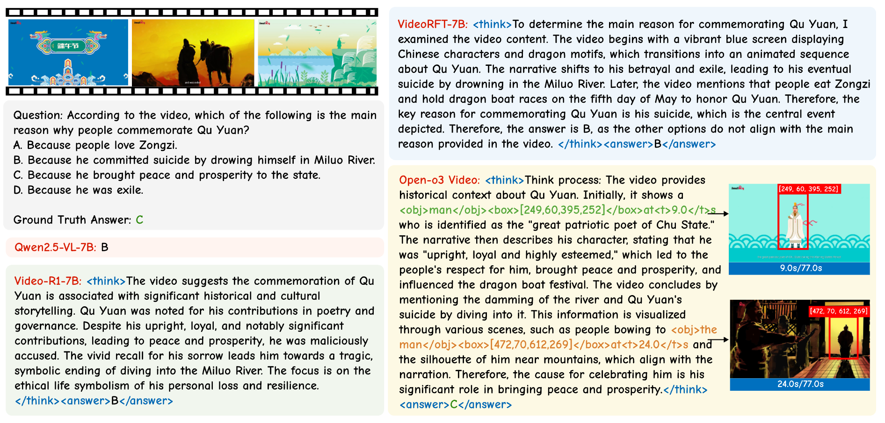
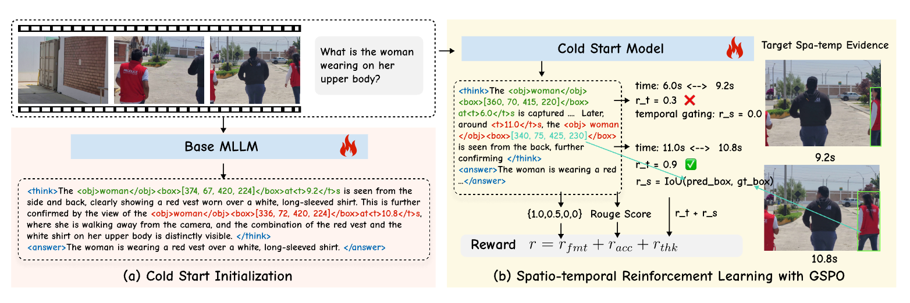

# Open-o3 Video

by
[Jiahao Meng](https://marinero4972.github.io/),
[Xiangtai Li](https://lxtgh.github.io/),
[Haochen Wang](https://haochen-wang409.github.io), 
[Yue Tan](https://tangent0308.github.io/),
[Tao Zhang](https://zhang-tao-whu.github.io/),
[Lingdong Kong](https://scholar.google.com/citations?user=-j1j7TkAAAAJ&hl=zh-CN),
[Yunhai Tong](https://scholar.google.com/citations?user=T4gqdPkAAAAJ),
[Anran Wang](https://sites.google.com/view/anranwang/home),
[Zhiyang Teng](https://scholar.google.com/citations?user=9wOJrf8AAAAJ&hl=zh-CN),
[Yujing Wang](https://scholar.google.com/citations?user=YgL4rywAAAAJ&hl=zh-CN&oi=ao)
and
[Zhuochen Wang](https://scholar.google.com/citations?hl=en&user=RDvwXDsAAAAJ),


[[📖 Paper](https://arxiv.org/pdf/2510.20579)] | [[🌟 Project Page](https://marinero4972.github.io/projects/Open-o3-Video/)] | [[🎥 Introduction](https://youtu.be/gymaTVRy0JY)] | [[🤗 Model](https://huggingface.co/marinero4972/Open-o3-Video/tree/main)] | [[🤗 Data](https://huggingface.co/datasets/marinero4972/Open-o3-Video/tree/main)]


**TL; DR**: Open-o3 Video integrates explicit spatio-temporal evidence into video reasoning through curated STGR datasets and a two-stage SFT–RL training strategy, achieving state-of-the-art results on V-STAR and delivering verifiable, reliable reasoning for video understanding.



**Abstract**: Most video reasoning models only generate textual reasoning traces without indicating when and where key evidence appears. Recent models such as OpenAI-o3 have sparked wide interest in evidence-centered reasoning for images, yet extending this ability to videos is more challenging, as it requires joint temporal tracking and spatial localization across dynamic scenes. We introduce **Open-o3 Video**, a non-agent framework that integrates explicit spatio-temporal evidence into video reasoning, and carefully collect training data and design training strategies to address the aforementioned challenges. The model highlights key timestamps, objects, and bounding boxes alongside its answers, allowing reasoning to be grounded in concrete visual observations. To enable this functionality, we first curate and build two high-quality datasets, **STGR-CoT-30k for SFT and STGR-RL-36k for RL**, with carefully constructed temporal and spatial annotations, since most existing datasets offer either temporal spans for videos or spatial boxes on images, lacking unified spatio-temporal supervision and reasoning traces. Then, we adopt a cold-start reinforcement learning strategy with multiple specially designed rewards that jointly encourage answer accuracy, temporal alignment, and spatial precision. On **V-STAR** benchmark, Open-o3 Video achieves **state-of-the-art performance**, raising mAM by 14.4% and mLGM by 24.2% on the Qwen2.5-VL baseline. Consistent improvements are also observed on a broad range of video understanding benchmarks, including VideoMME, WorldSense, VideoMMMU, and TVGBench. Beyond accuracy, the reasoning traces produced by Open-o3 Video also provide valuable signals for test-time scaling, enabling confidence-aware verification and improving answer reliability.

**Open-o3 Video Model**:

Stage 1: Cold-start initialization on STGR-CoT-30k equips the model with basic grounded reasoning. 

Stage 2: Reinforcement learning with Group Sequence Policy Optimization stabilizes long-horizon optimization. We propose **adaptive temporal proximity** and **temporal gating** in the thinking reward design.



# Quick Start

## Environment setup:

```bash
git clone https://github.com/marinero4972/Open-o3-Video 
cd Open-o3-Video 

conda create -n open-o3-video python=3.11
conda activate open-o3-video
bash setup.sh
```

## Data Preparation:

To provide unified spatio-temporal supervision for grounded video reasoning, we build two datasets: STGR-CoT-30k for supervised fine-tuning and STGR-RL-36k for reinforcement learning. 

Json data download link: [STGR](https://huggingface.co/datasets/marinero4972/Open-o3-Video/tree/main)

The overall data structure should be:
```sh
DATA_ROOT
├── json_data
│   └── STGR-RL.json
│   └── STGR-SFT.json
└── videos
    └── gqa
    └── stgr
        └── plm
        └── temporal_grounding
    └── timerft
    └── treevgr
    └── tvg_r1
    └── videoespresso
    └── videor1
```

You should refine the DATA_ROOT in [`src/r1-v/configs/data_root.py`](src/r1-v/configs/data_root.py) according to your data path.

## Training:

```bash
# cold start initialization
bash ./src/scripts/run_sft_video.sh

# reinforcement learning with GSPO
bash ./src/scripts/run_grpo_video.sh
```

## Evaluation:

Evaluate on benchmarks:

```bash
cd eval
bash ./scripts/eval_all.sh
```

Infernce on examples:

```bash
cd eval
python ./inference_example.py
```


# License

This project is licensed under the [Apache-2.0 License](LICENSE).


# Citation

If you use our work or our implementation in this repo, or find them helpful, please consider giving a citation in the following format.

```
@article{meng2025open-o3,
  title={Open-o3 Video: Grounded Video Reasoning with Explicit Spatio-Temporal Evidence}, 
  author={Jiahao Meng, Xiangtai Li, Haochen Wang, Yue Tan, Tao Zhang, Lingdong Kong, Yunhai Tong, Anran Wang, Zhiyang Teng, Yujing Wang, Zhuochen Wang},
  journal={arXiv preprint arXiv:2510.20579},
  year={2025}
}
```

# Acknowledgements

We sincerely thank the following projects for their contributions to this work:

- [Video-R1](https://github.com/tulerfeng/Video-R1)
- [R1-V](https://github.com/Deep-Agent/R1-V) 